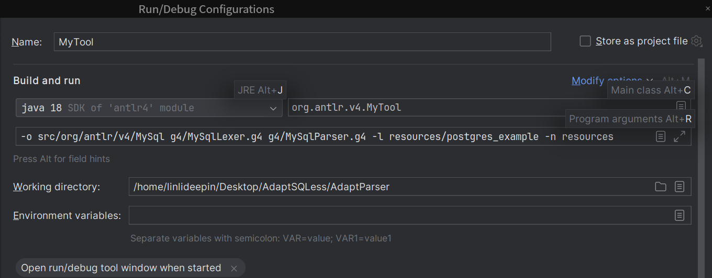

# AdaptParser
## Building AdaptParser

Building AdaptParser in Intellij IDE : After download AdaptParser source, just "import project from existing sources" and click on the "Maven Projects" tab in right gutter of IDE. It should build stuff in the background automatically and look like:


**OR**

```
cd AdaptParser
mvn install 
```


If you see the information, the project builds successful!

```
[INFO] ------------------------------------------------------------------------
[INFO] BUILD SUCCESS
[INFO] ------------------------------------------------------------------------
[INFO] Total time:  04:36 min
[INFO] Finished at: 2023-12-20T17:15:11+08:00
[INFO] ------------------------------------------------------------------------
```


## Options

| option | description                                                  |
| ------ | ------------------------------------------------------------ |
| `-o`   | ANTLR generates output files in the current directory by default. This  option specifies the output directory where ANTLR should generate  parsers, listeners, visitors, and tokens files. |
| -l     | The paths to Standard grammar files.                         |
| -n     | The paths to new  grammar files adapted by AdaptParser.      |


## Example

```
-o src/org/antlr/v4/MySql g4/MySqlLexer.g4 g4/MySqlParser.g4 -l resources/postgres_example -n resources
```

1. `-o src/org/antlr/v4/MySql`: This argument specifies the output directory. In this case, the generated files will be placed in the `src/org/antlr/v4/MySql` directory.
2. `g4/MySqlLexer.g4 g4/MySqlParser.g4`: These are the paths to Standard grammar files. The `MySqlLexer.g4` and `MySqlParser.g4` files contain rules and definitions for building a syntax parser. They are located in the `g4` directory. We will reconstruct the grammar files after adapting the dialects.
3. `-l resources/postgres_example`: This argument appears to specify the directory of the dialect files that need to be adapted. In this example, the `resources/postgres_example` directory contains specific dialects or example data that may be used for adapting or reference.
4. `-n resources`: This argument specifies the directory where the new grammars will be generated. In this case, any new grammars or related files will be placed in the `resources` directory.


Edit Run Configurations like this:



**OR**

```
java -cp target/AdaptParser-4.11.1-complete.jar org.antlr.v4.MyTool -o src/org/antlr/v4/MySql g4/MySqlLexer.g4 g4/MySqlParser.g4 -l resources/postgres_example -n resources
```


If you see the information, the project runs successful!

```
Grammar file updated successfully. New file: resources/MySqlParser.g4. 
```

It's a new grammar file that can parse different dialects.


## Test Parsing (Optional)

This step is optional!

To check if a SQL statement can be successfully parsed by an ANTLR grammar (g4 file), follow these steps:

**1. Install ANTLR**

Ensure that ANTLR is installed on your system. If it's not, visit the [ANTLR official website](https://www.antlr.org/) to download and install it following the provided instructions.

**2. Generate the Parser and Lexer**

Generate the parser and lexer using your g4 file. Open a terminal, navigate to the directory containing your g4 file, and execute the following commands:

```
antlr4 MySqlLexer.g4
antlr4 MySqlParser.g4
```

These commands will create Java classes based on your g4 file.

**3. Compile the Generated Java Classes**

Compile the generated Java classes by running the following in your terminal:

```
javac MySqlLexer.java MySqlParser.java
```

**4. Test the SQL Statement**

Write a simple test program to load your SQL statement and use the generated parser to parse it. This can be done by creating a Java program, for example:

```java
import org.antlr.v4.runtime.*;
import org.antlr.v4.runtime.tree.*;

public class SqlTest {
    public static void main(String[] args) throws Exception {
        // Replace 'your SQL statement' with the SQL statement you want to test
        ANTLRInputStream input = new ANTLRInputStream("your SQL statement");
        MySqlLexer lexer = new MySqlLexer(input);
        CommonTokenStream tokens = new CommonTokenStream(lexer);
        MySqlParser parser = new MySqlParser(tokens);
        ParseTree tree = parser.sqlStatement(); // Assuming 'sqlStatement' is your start rule

        // Print the parse tree
        System.out.println(tree.toStringTree(parser));
    }
}
```

**5. Run the Test Program**

Compile and run your test program. If the SQL statement is successfully parsed by the grammar, you will see the output of the parse tree. If there are errors during parsing, ANTLR usually provides error messages to help identify the issue.
