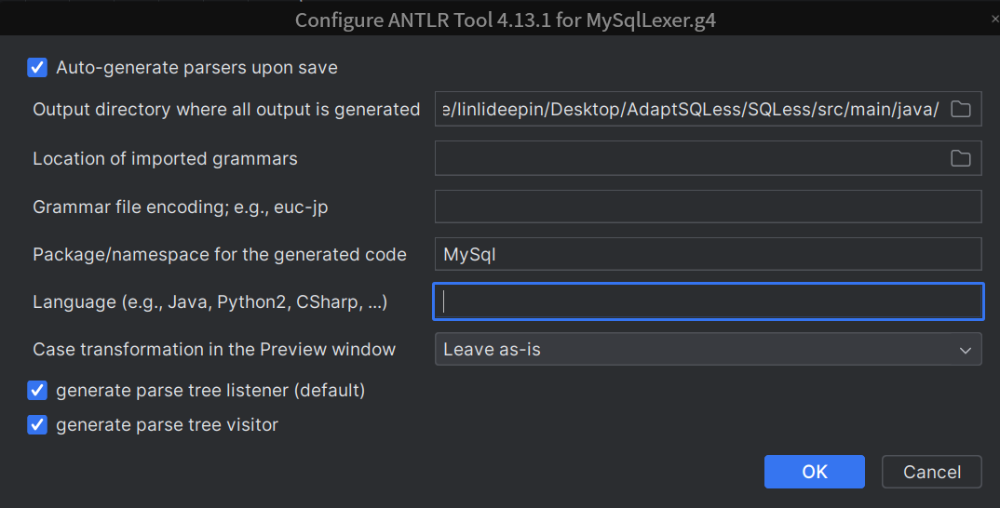
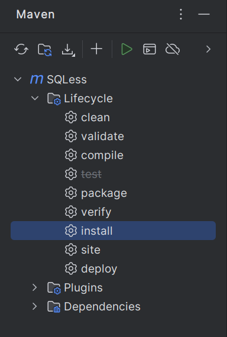
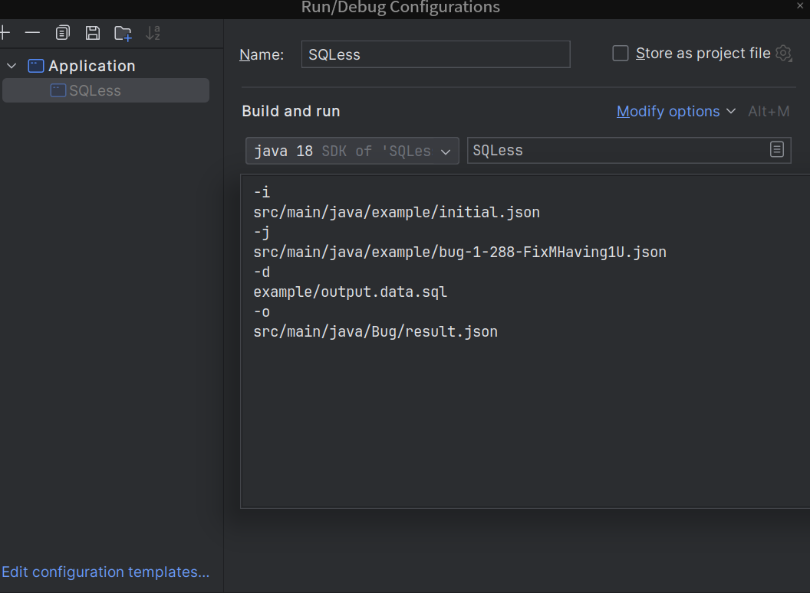

# SQLess

## Prepare

### Prepare your Parser

Firstly, you should utilize ANTLR to automatically generate a parser that overrides the originally generated parser code using the newly generated grammar file from AdaptParser if your SQL statements contain dialects. 

**How to generate a parser ?**

copy the grammar file to `{SQLESSHOME}\src/g4/new_parser`

**1、Install ANTLR plugin**: Open IntelliJ IDEA, navigate to File — Settings — Plugins, and install the ANTLR v4 grammar plugin.

**2、Configure ANTLR Plugin Settings**: Go to File — Settings — Languages & Frameworks — ANTLR, and adjust the settings to match your project setup. 

In the ANTLR configuration window, there are two main settings that you can configure:

1. **Output Directory**: This is the directory where all generated output from ANTLR will be placed. It's typically a path to a source folder in your project where you want the generated parser, lexer, listener, and visitor files to be saved. In the provided configuration, the output directory is set to `{SQLESSHOME}/src/main/java/`.
2. **Package/namespace for the generated code**: This setting specifies the package or namespace under which the generated code will reside. This is important for Java and other languages that use namespaces or packages to organize code. In the screenshot, the package is set to `MySql`, meaning the generated code will be part of the `MySql` package.




**3、Generate ANTLR Artifacts**: Right-click on the `.g4` grammar file in your project and  select "Generate ANTLR Recognizer". This will invoke the ANTLR tool to  generate the parser, lexer, and other necessary components.

At this point, you have overridden the original parser and can now parse different dialects.


### Start your DBMS

For example, you can start mysql with docker:

```
sudo docker run -itd --name mysqltest -p 13306:3306 -e MYSQL_ROOT_PASSWORD=123456 mysql:8.0.30
```

You can also compile and install the DBMS yourself.

Then create a database:

```
sudo mysql -h127.0.0.1 -uroot -P13306 -p123456
create database TEST3;
```


## Build SQLess

Building SQLess in Intellij IDE : After download SQLess source, just "import project from existing sources" and click on the "Maven Projects" tab in right gutter of IDE. It should build stuff in the background automatically and look like:



**OR**

```
cd SQLess
mvn install 
```


If you see the information, the project builds successful!

```
[INFO] ------------------------------------------------------------------------
[INFO] BUILD SUCCESS
[INFO] ------------------------------------------------------------------------
[INFO] Total time:  24.772 s
[INFO] Finished at: 2023-12-23T00:09:42+08:00
[INFO] ------------------------------------------------------------------------
```


## Run SQLess

If you need to simplify an SQL query, you will require three files.

### Input  

| file                                    | description                                                  |
| --------------------------------------- | ------------------------------------------------------------ |
| Initial.json                            | This JSON file contains configuration settings for a database  connection, specifying details such as the mutation name, database  management system (DBMS) type, host address, port, and credentials  (username, password) |
| bug-`bugId`-`sqlId`-`mutationName`.json | Save the mutation name, original sql, original result, mutated sql, mutated result, and the relationship(`IsUpper`) between the original result and the mutated result we expect. `[IsUpper] true` means that the mutated result  should ⊆ the original result. |
| output.data.sql                         | Sql file responsible for creating data.                      |

SQLess provides an example with the specific directory structure below, which includes the following files:

```
${SQLESSHOME}/java
|-- Bug
|   |-- result.json
|-- example
    |-- bug-1-288-FixMHving1U.json
    |-- initial.json
    |-- output.data.sql
```


### SQLess for simplification

| option | description                                |
| ------ | ------------------------------------------ |
| `-i`   | Initial.json                               |
| `-j`   | bug-`bugId`-`sqlId`-`mutationName`.json    |
| `-d`   | output.data.sql                            |
| `-o`   | The location of the simplified bug report. |

example:

```
-i
src/main/java/example/initial.json
-j
src/main/java/example/bug-1-288-FixMHaving1U.json
-d
example/output.data.sql
-o
src/main/java/Bug/result.json
```

Edit Run Configurations like this:



**OR**

```
java -cp target/SQLess-1.0-SNAPSHOT.jar SQLess -i src/main/java/example/initial.json -j src/main/java/example/bug-1-288-FixMHaving1U.json -d example/output.data.sql -o src/main/java/Bug/result.json
```


If you see the information, the project runs successful!

```
-------------------------------------
Simplify SQL query successfully!
-------------------------------------
```


### Output

The output file `result.json` contains the complete bug report information, including the simplified SQL query.

```json
{
  "originalSql" : "SELECT (DATE_SUB(_UTF8MB4'2019-08-05', INTERVAL 1 DAY_SECOND)>>`f4`*COS(7327249037932383944)) AS `f1`,(COLLATION(`f4`)&`f5`) AS `f2`,(`f6`) AS `f3` FROM (SELECT `col_varchar(20)_key_signed` AS `f4`,`col_char(20)_undef_signed` AS `f5`,`col_double_key_signed` AS `f6` FROM `table_3_utf8_undef` FORCE INDEX (`col_double_key_unsigned`, `col_varchar(20)_key_signed`)) AS `t1` WHERE (((DATE_SUB(COERCIBILITY(`f4`), INTERVAL 1 DAY_MINUTE))<=ANY (SELECT `col_float_undef_signed` FROM `table_3_utf8_undef` USE INDEX (`col_bigint_key_signed`))) OR ((CAST((DAYOFMONTH(_UTF8MB4'2005-03-14')) AS CHAR) LIKE _UTF8MB4'%1%') IS TRUE)) IS TRUE HAVING (((`f2`+`f3`+CHAR_LENGTH(`f1`)) NOT IN (CHARSET(`f2`),`f2`,_UTF8MB4'2013-10-09')) OR (NOT ((FORMAT_BYTES(`f1`))=ANY (SELECT `col_char(20)_undef_signed` FROM `table_7_utf8_undef` USE INDEX (`col_bigint_key_unsigned`, `col_double_key_signed`)))) OR ((DATE_SUB(~`f3`, INTERVAL 1 MONTH)) IS TRUE)) IS TRUE ORDER BY `f5`",
  "mutatedSql" : "SELECT (DATE_SUB(_UTF8MB4'2019-08-05', INTERVAL 1 DAY_SECOND)>>`f4`*COS(7327249037932383944)) AS `f1`,(COLLATION(`f4`)&`f5`) AS `f2`,(`f6`) AS `f3` FROM (SELECT `col_varchar(20)_key_signed` AS `f4`,`col_char(20)_undef_signed` AS `f5`,`col_double_key_signed` AS `f6` FROM `table_3_utf8_undef` FORCE INDEX (`col_double_key_unsigned`, `col_varchar(20)_key_signed`)) AS `t1` WHERE (((DATE_SUB(COERCIBILITY(`f4`), INTERVAL 1 DAY_MINUTE))<=ANY (SELECT `col_float_undef_signed` FROM `table_3_utf8_undef` USE INDEX (`col_bigint_key_signed`))) OR ((CAST((DAYOFMONTH(_UTF8MB4'2005-03-14')) AS CHAR) LIKE _UTF8MB4'%1%') IS TRUE)) IS TRUE HAVING 1 ORDER BY `f5`",
  "upper" : true,
  "slimoriginalSql" : "SELECT (COLLATION(`f4`)) AS `f2`,(`f6`) AS `f3` FROM (SELECT `col_varchar(20)_key_signed` AS `f4`,`col_char(20)_undef_signed` AS `f5`,`col_double_key_signed` AS `f6` FROM `table_3_utf8_undef` FORCE INDEX (`col_double_key_unsigned`, `col_varchar(20)_key_signed`)) AS `t1`   ORDER BY `f5`",
  "slimmutatedSql" : "SELECT DISTINCT  (COLLATION(`f4`)) AS `f2`,(`f6`) AS `f3` FROM (SELECT `col_varchar(20)_key_signed` AS `f4`,`col_char(20)_undef_signed` AS `f5`,`col_double_key_signed` AS `f6` FROM `table_3_utf8_undef` FORCE INDEX (`col_double_key_unsigned`, `col_varchar(20)_key_signed`)) AS `t1`   ORDER BY `f5`",
  "reportTime" : "2022-12-23 13:33:58.027685794 +0800 CST m=+13561.912318044",
  "mutationName" : "pinolo",
  "isUpper" : true,
  "ddlPath" : "example/output.data.sql",
  "dbms" : "mysql",
  "host" : "127.0.0.1",
  "port" : 13306,
  "username" : "root",
  "password" : "123456",
  "dbname" : "TEST3"
}
```

